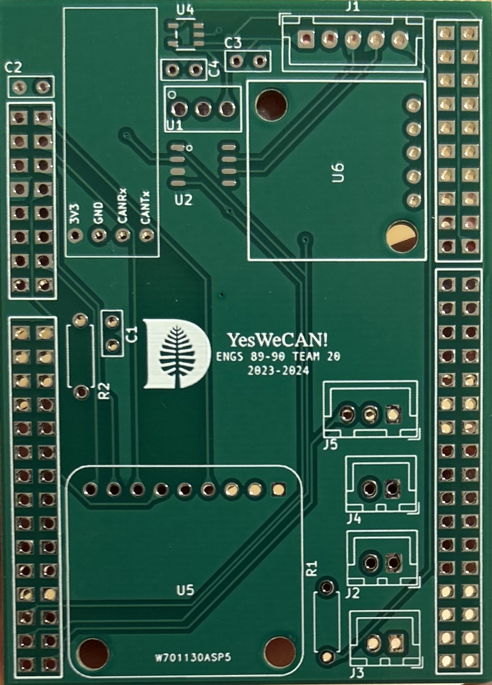
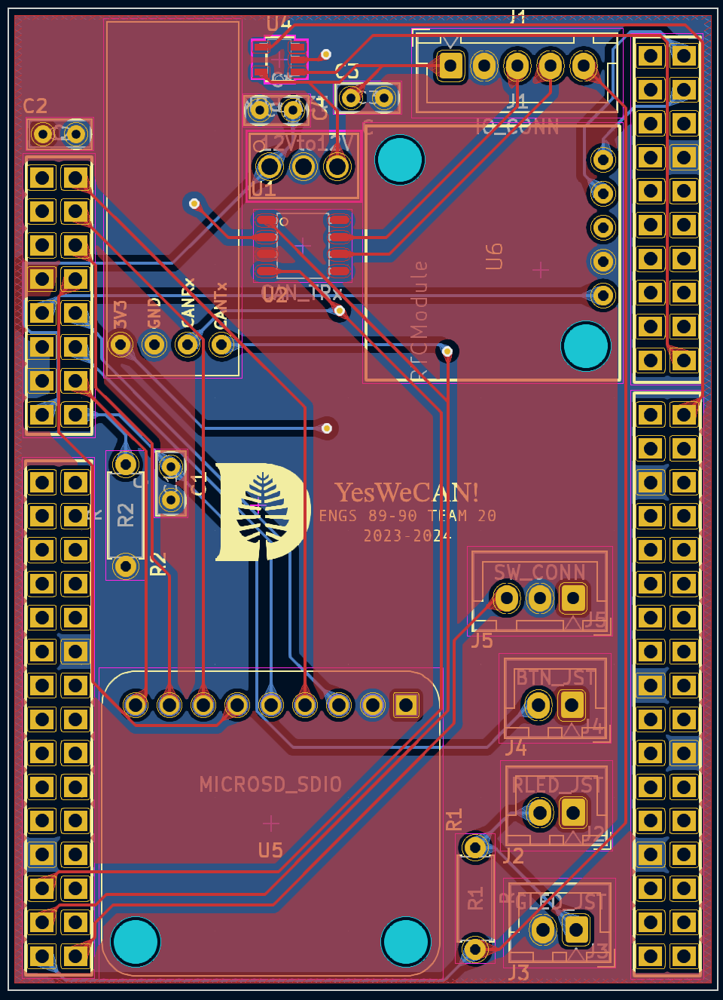
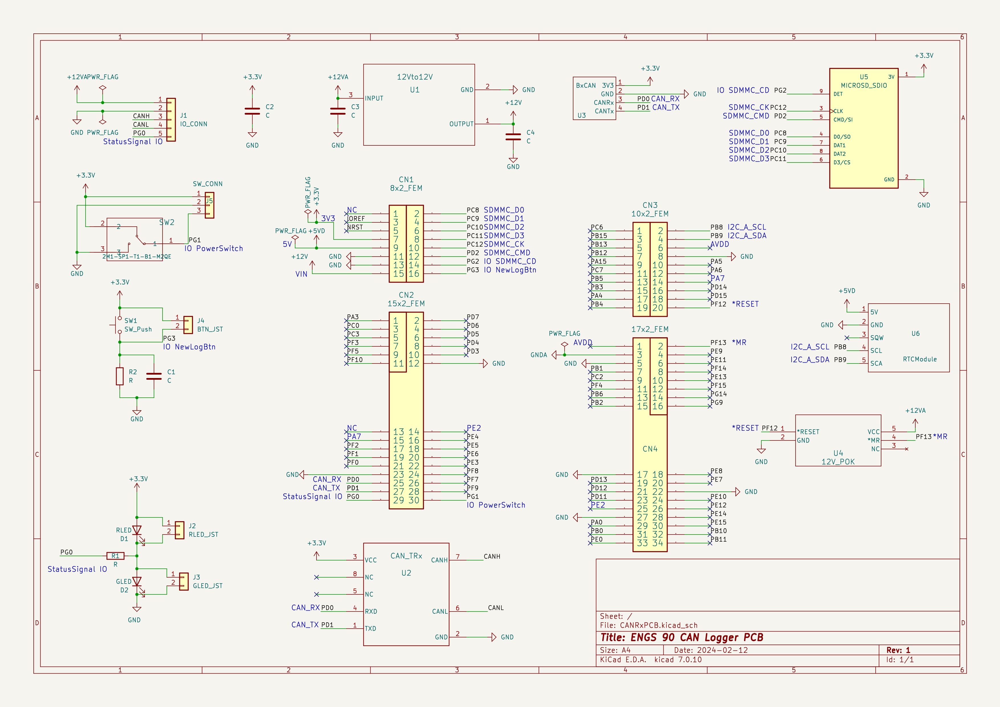

# CAN Data Logger PCB
## Team 20 ENGS 89/90 2023-2024

YesWeCAN! shield for STM32 Nucleo F767ZI for CAN logger. Gerber files have been uploaded and are ready to be sent for manufacturing.

**CAN Logger UI Code:** https://github.com/Dartmouth-Formula-Racing/CAN_LOGGER_UI

**CAN Logger Device Code:** https://github.com/Dartmouth-Formula-Racing/CAN_LOGGER_DEVICE

**Bill of Materials:** https://docs.google.com/spreadsheets/d/1NrKLE5knV5BPY-2oF7sqC7h2m7aHoQsADQELiZiT3k4/edit?usp=sharing

## PCB Images

## Schematic

